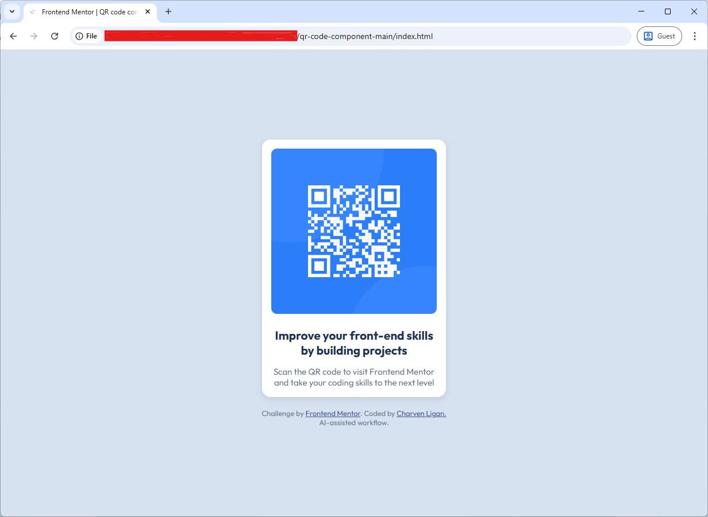

# Frontend Mentor - QR code component solution

This is my solution to the [QR code component challenge on Frontend Mentor](https://www.frontendmentor.io/challenges/qr-code-component-iux_sIO_H). Frontend Mentor challenges help you improve your coding skills by building realistic projects.  

## Table of contents

- [Overview](#overview)
  - [Screenshot](#screenshot)
  - [Links](#links)
- [My process](#my-process)
  - [Built with](#built-with)
  - [What I learned](#what-i-learned)
- [Author](#author)

---

## Overview

### Power Apps Version

[📱 Download Power Apps Component](./FMQRCodeComponent.msapp)

### Screenshot



*(Screenshot taken using the browser's built-in screenshot tool.)*

### Links

- **Solution URL:** [https://github.com/charv3n/fm-qr-code-component](https://github.com/charv3n/fm-qr-code-component)
- **Live Site URL:** [https://charv3n.github.io/fm-qr-code-component/](https://charv3n.github.io/fm-qr-code-component/)

---

## My process

### Built with

- Semantic **HTML5** markup  
- **CSS custom properties** (variables)
- **Flexbox** for centering  
- **Mobile-first** workflow  

### What I learned

This project helped me practice using Flexbox for vertical and horizontal centering:  

```css
body {
  display: flex;
  justify-content: center;
  align-items: center;
  min-height: 100vh;
}